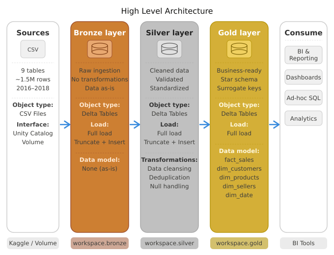

# Olist Brazilian E-Commerce Data Warehouse

A end-to-end data warehouse project built on **Databricks** using the **Medallion Architecture** (Bronze → Silver → Gold).  
This project ingests the [Olist Brazilian E-Commerce dataset](https://www.kaggle.com/datasets/olistbr/brazilian-ecommerce) from Kaggle, applies data quality transformations, and models a **Star Schema** ready for BI analytics.

---

## Table of Contents
- [Project Overview](#project-overview)
- [Architecture](#architecture)
- [Tech Stack](#tech-stack)
- [Dataset](#dataset)
- [Data Quality Issues & Fixes](#data-quality-issues--fixes)
- [Star Schema Design](#star-schema-design)
- [Project Structure](#project-structure)
- [How to Run](#how-to-run)
- [Business Questions Answered](#business-questions-answered)

---

## Project Overview

| Item | Detail |
|------|--------|
| **Platform** | Databricks (Free Edition) |
| **Storage** | Unity Catalog + Delta Lake |
| **Architecture** | Medallion (Bronze → Silver → Gold) |
| **Data Modeling** | Star Schema (Kimball methodology) |
| **Language** | PySpark + Spark SQL |
| **Source Data** | Olist Brazilian E-Commerce (Kaggle) |
| **Data Period** | 2016 – 2018 |
| **Total Records** | ~1.5M rows across 9 source tables |

---

## Architecture



**Bronze Layer** — Raw ingestion from CSV files stored in Unity Catalog Volume. Data is stored as-is with no business transformations. One technical fix is applied on `order_reviews`: embedded newlines in comment columns are cleaned on-the-fly using `multiLine=True` and `regexp_replace`.

**Silver Layer** — Cleaned and validated Delta Tables. Data quality issues are handled here (see section below). No business aggregations — standardization and deduplication only.

**Gold Layer** — Star schema Delta Tables optimized for BI and analytics. Surrogate keys are applied on all dimension tables following Kimball methodology.

---

## Tech Stack

| Tool | Usage |
|------|-------|
| **Databricks** | Unified analytics platform |
| **Delta Lake** | Storage format for all layers |
| **Unity Catalog** | Data governance & access control |
| **PySpark** | Bronze ingestion & data reading |
| **Spark SQL** | Silver transformations & Gold modeling |
| **GitHub** | Version control |

---

## Dataset

Source: [Olist Brazilian E-Commerce Dataset](https://www.kaggle.com/datasets/olistbr/brazilian-ecommerce) on Kaggle.

| Table | Description | Rows |
|-------|-------------|------|
| `olist_customers_dataset.csv` | Customer information | 99,441 |
| `olist_geolocation_dataset.csv` | ZIP code to coordinates mapping | 1,000,163 |
| `olist_order_items_dataset.csv` | Items within each order | 112,650 |
| `olist_order_payments_dataset.csv` | Payment information per order | 103,886 |
| `olist_order_reviews_dataset.csv` | Customer reviews | 99,224 |
| `olist_orders_dataset.csv` | Order header information | 99,441 |
| `olist_products_dataset.csv` | Product information | 32,951 |
| `olist_sellers_dataset.csv` | Seller information | 3,095 |
| `product_category_name_translation.csv` | Portuguese to English category names | 71 |

---

## Data Quality Issues & Fixes

| Layer | Table | Issue | Fix |
|-------|-------|-------|-----|
| Bronze | `order_reviews` | Embedded newlines (`\n`, `\r`) in comment columns causing CSV parser to misread rows | Read with `multiLine=True` + `regexp_replace` on-the-fly |
| Silver | `geolocation` | Corrupt UTF-8 encoding in city names, coordinate outliers outside Brazil bounding box, multiple city names per zip code | Filter outliers by Brazil bounding box, compute median coordinates per zip code, keep most frequent city name (mode) |
| Silver | `order_reviews` | 789 duplicate `review_id` assigned to multiple `order_id` (source system bug) | Deduplicate using `ROW_NUMBER()`, keep one row per `review_id` |
| Silver | `order_payments` | 2 rows with `payment_installments = 0` on `credit_card` | Replace 0 with 1 |
| Silver | `products` | 610 rows with NULL `product_category_name` | Replace with `'unknown'` |
| Silver | `sellers` | 3 rows with corrupt UTF-8 encoding in `seller_city` | Exclude those rows |

Full data quality check scripts are available in the [`data_quality/`](data_quality/) folder.

---

## Star Schema Design

```
                      ┌──────────────┐
                      │   dim_date   │
                      │──────────────│
                      │ date_key (PK)│
                      │ full_date    │
                      │ year, quarter│
                      │ month, day   │
                      └──────┬───────┘
                             │
┌────────────────┐  ┌────────┴────────────┐  ┌─────────────────┐
│ dim_customers  │  │      fact_sales      │  │   dim_products  │
│────────────────│  │─────────────────────│  │─────────────────│
│customer_key(PK)├──│customer_key    (FK) │  │product_key (PK) │
│customer_id     │  │product_key     (FK) ├──│product_id       │
│customer_city   │  │seller_key      (FK) │  │category_name    │
│customer_state  │  │date_key        (FK) │  │category_english │
│geolocation_lat │  │─────────────────────│  │product_weight_g │
│geolocation_lng │  │order_id             │  └─────────────────┘
└────────────────┘  │order_item_id        │
                    │order_status         │  ┌─────────────────┐
                    │price                │  │   dim_sellers   │
                    │freight_value        │  │─────────────────│
                    │total_payment_value  │  │seller_key  (PK) │
                    │review_score         ├──│seller_id        │
                    │delivery_time_days   │  │seller_city      │
                    │delivery_delay_days  │  │seller_state     │
                    │is_late              │  │geolocation_lat  │
                    └─────────────────────┘  │geolocation_lng  │
                                             └─────────────────┘
```

**Surrogate Key Pattern (Kimball methodology)**:
- All dimension tables use integer surrogate keys as primary keys (`ROW_NUMBER()`)
- Natural keys are retained in dimension tables for traceability
- Fact table stores only surrogate keys as foreign keys
- `order_id` and `order_item_id` are retained in fact as **degenerate dimensions**

---

## Project Structure

```
olist-data-warehouse/
├── images/
│   └── architecture.png                  # Architecture diagram
├── notebook/
│   ├── 01_bronze_ingestion.ipynb         # Raw CSV ingestion to Bronze Delta Tables
│   ├── 02_silver_cleaning.ipynb          # Data quality fixes, Bronze → Silver
│   └── 03_gold_modeling.ipynb            # Star schema modeling, Silver → Gold
├── data_quality/
│   ├── check_customers.sql               # DQ checks for customers table
│   ├── check_geolocation.sql             # DQ checks for geolocation table
│   ├── check_order_items.sql             # DQ checks for order_items table
│   ├── check_order_payments.sql          # DQ checks for order_payments table
│   ├── check_order_reviews.sql           # DQ checks for order_reviews table
│   ├── check_orders.sql                  # DQ checks for orders table
│   ├── check_products.sql                # DQ checks for products table
│   └── check_sellers.sql                 # DQ checks for sellers table
├── LICENSE
└── README.md
```

---

## How to Run

### Prerequisites
- Databricks workspace with Unity Catalog enabled
- Raw CSV files uploaded to: `/Volumes/workspace/default/datasalman/olist_raw/`

### Execution Order
Run notebooks **in sequence** — each layer depends on the previous:

```
1. notebook/01_bronze_ingestion.ipynb
2. notebook/02_silver_cleaning.ipynb
3. notebook/03_gold_modeling.ipynb
```

### Expected Output
After running all notebooks, the following Delta Tables will be available:

| Layer | Schema | Tables |
|-------|--------|--------|
| Bronze | `workspace.bronze` | 9 tables (raw) |
| Silver | `workspace.silver` | 9 tables (cleaned) |
| Gold | `workspace.gold` | 5 tables (4 dims + 1 fact) |

---

## Business Questions Answered

The Gold layer is designed to answer 30 business questions across 3 dashboards:

### Dashboard 1: Sales & Customer Overview
- Total revenue per month & MoM growth trend
- Total orders per month & Average Order Value (AOV)
- % orders delivered vs canceled
- Revenue contribution per product category
- Seasonality in sales
- Top customer states by volume
- Unique customers per month
- Overall average review score & trend over time
- % customers with repeat orders

### Dashboard 2: Operations & Delivery
- Total late orders vs on-time orders
- Average delivery time (purchase → delivered)
- States with most delivery delays
- Average gap between estimated and actual delivery
- Delivery time improvement over time
- Correlation between late delivery and low review scores
- Product categories with highest/lowest review scores

### Dashboard 3: Seller & Product Performance
- Active sellers per month & trend over time
- Top seller states by volume
- Top sellers by revenue
- Sellers with most late deliveries
- Average review score per seller
- Top product categories by quantity sold & revenue
- Correlation between product weight and freight value
- Most canceled product categories
